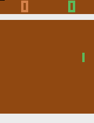
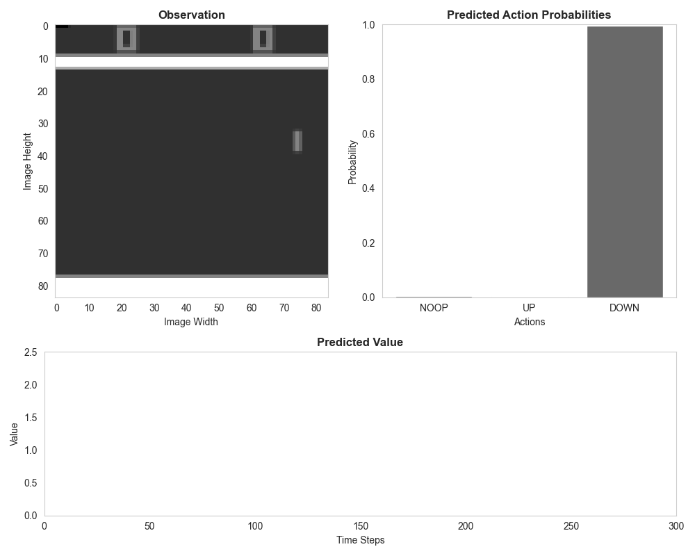
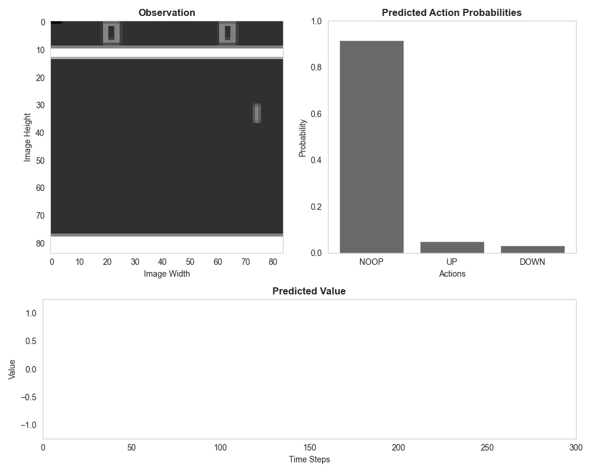

 

    
    <h1>Research Essay: Reinforcement Learning</h1>
    <h2>Playing Pong - A Hybrid Learning Approach</h2>
     
     
    

        
        
        
        
A random, pre-trained, and finetuned agent playing Pong from left to right, respectively.

    

## Description

This repository contains the code used to train a reinforcement learning agent to play the game of Pong. The agent is
trained using a hybrid learning approach, combining supervised learning and reinforcement learning. The agent is based 
on a convolutional neural network and is finetuned using the Proximal Policy Optimization (PPO) algorithm. The code is
uses the PyTorch Lightning Fabric, Stable_Baselines3, Gymnasium, and the Arcade Learning Environment (ALE) libraries.

The code is structured as follows:
* `assets/`: Contains the images and gifs used in this README.
* `logs/`: Contains the TensorBoard logs for all experiments.
* `models/`: Contains the weights for the trained models.
* `experiments.ipynb`: The main notebook containing the experiments.
* `extras.ipynb`: The code for some additional visualizations.
* `dataset.py`: The code for creating the dataset.
* `supervised.py`: The code for training the supervised model.
* `utils.py`: The code for some utility functions.
* `requirements.txt`: Contains the required libraries for this project.

## Showcase

    

The gif above shows the agent playing Pong after being finetuned using the PPO algorithm. The agent is able to 
consistently beat the opponent, demonstrating that the hybrid learning approach is effective in training the agent.
The predicted actions are shown in realtime in the top right. The lower graph shows the estimated value by the value
network across all time steps. The cyclic pattern of the value estimates is due to the nature of the game, where the
value of the state changes drastically as the agent scores points.

 
 

    

This gif shows the supervised pre-trained model playing Pong. The agent is able to score points but far less consistent
compared to the finetuned agent. Since the value network is not pre-trained, the predicted value is just a randomly
distributed variable and does not provide any useful information.

 
 

    

The final gif shows a policy based on selecting random actions. Therefore, the random policy is not able to score any
points. Since the paddle is not controlled by a neural network, the predicted actions and values are calculated
using the finetuned model. As expected, the state values are fluctuating dramatically without the showing signs
of the dominant cyclical pattern observed in the finetuned agent.

## License

This project was developed as part of the course "Reinforcement Learning" at the International University of 
Applied Sciences (IU) and is not intended for use other than educational purposes.

## References

* [PyTorch Lightning Fabric](https://github.com/Lightning-AI/pytorch-lightning/tree/master/src/lightning_fabric)
* [Stable_Baselines3](https://github.com/DLR-RM/stable-baselines3)
* [Gymnasium](https://github.com/Farama-Foundation/Gymnasium)
* [Arcade Learning Environment (ALE)](https://github.com/Farama-Foundation/Arcade-Learning-Environment)
* [PyTorch](https://pytorch.org/)
